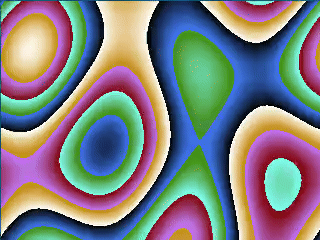
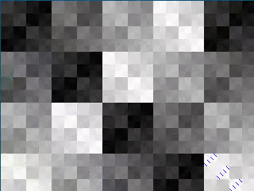
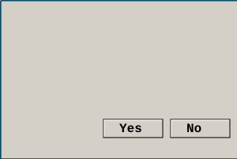

# Fenstim
Fenstim is a Nim wrapper for [Fenster](https://github.com/zserge/fenster), the most minimal cross-platform GUI with 2D canvas library. It provides a simple and efficient way to create graphical applications in Nim.

# Implementation status
- [x] Minimal 24-bit RGB framebuffer.
- [x] Application lifecycle and system events are all handled automatically.
- [x] Simple polling API without a need for callbacks or multithreading (like Arduino/Processing).
- [x] Cross-platform keyboard events (keycodes).
- [x] Cross-platform mouse events (X/Y + mouse click).
- [x] Cross-platform timers to have a stable FPS rate. (builtin)
- [ ] Cross-platform audio playback (WinMM, CoreAudio, ALSA). [#1](https://github.com/CardealRusso/fenstim/issues/1)

# Credits
Project done in collaboration with @ElegantBeef and @morturo at https://forum.nim-lang.org/t/12504

# Examples
Basic usage
```nim
import fenstim

var app = init(Fenster, "My Window", 800, 600, 60)

if app.loop:
  echo "Window target FPS: ", app.targetFps, ", Resolution: ", app.width, "x", app.height

while app.loop:
  # Set pixel color
  app[400, 300] = 16711680  # Decimal red
  app[410, 300] = (0, 255, 0)  # (r, g, b) green
  app[420, 300] = 0x0000FF # Hexadecimal blue

  # Get pixel color
  let color = app[420, 300] # Decimal

  # Check key press
  if app.keys[ord('A')] == 1:
    echo "A key is pressed"

  # Get mouse position and click state
  let (mouseX, mouseY, mouseClick) = app.mouse

  # Adjust FPS
  app.targetFps = 30
```

Opens a 60fps 800x600 window, draws a red square and exits when pressing the Escape key:

```nim
# examples/red_square.nim
import fenstim

var app = init(Fenster, "Red square with fenstim", 800, 600, 60)

while app.loop and app.keys[27] == 0:
  for x in 350 .. 450:
    for y in 250 .. 350:
      app[x, y] = 0xFF0000
```

# API usage
### Initialization
```nim
proc init*(_: type Fenster, title: string, width, height: int, fps: int = 60): Fenster
```  
Creates a new Fenster window with the specified title, dimensions, and target FPS.

### Main Loop
```nim
proc loop*(self: var Fenster): bool
```
Handles events and updates the display. Returns false when the window should close.

### Pixel Manipulation
```nim
proc `[]`*(self: Fenster, x, y: int): uint32
proc `[]=`*(self: Fenster, x, y: int, color: SomeInteger)
proc `[]=`*(self: Fenster, x, y: int, color: tuple[r, g, b: SomeInteger])
```
Get or set pixel color at (x, y). Color can be specified as a 32-bit integer or as an (r, g, b) tuple.

### Window Properties
```nim
proc width*(self: Fenster): int
proc height*(self: Fenster): int
proc targetFps*(self: Fenster): int
proc `targetFps=`*(self: var Fenster, fps: int)
proc close*(self: var Fenster)
```

### Input Handling
```nim
proc keys*(self: Fenster): array[256, cint]
proc mouse*(self: Fenster): tuple[x, y, click: int]
proc modkey*(self: Fenster): int
```
keys = Array of key states. Index corresponds to ASCII value (0-255), but arrows are 17..20.  
mouse = Get mouse position (x, y) and click state.  
modkey = 4 bits mask, ctrl=1, shift=2, alt=4, meta=8

# Examples
```nim
  t += 0.1
  for i in 0..<app.width:
    for j in 0..<app.height:
      let plasma = sin(i.float * 0.04 + t) + sin(j.float * 0.03) + sin((i.float + j.float) * 0.02 + t)
      let color = uint32((plasma + 3) * 85)
      app[i, j] = color shl 16 or (color shl 1) shl 8 or color shl 2
```


```nim
  t += 1
  for i in 0..<app.width:
    for j in 0..<app.height:
      app[i, j] = (i xor j xor t) * 65793
```


```nim
  t += 1
  for i in 0..<app.width:
    for j in 0..<app.height:
      app[i, j] = (i * j * t)
```


```nim
import fenstim, math

var 
  app = init(Fenster, "Interactive Julia Set", 800, 600, 60)
  cx, cy: float32 = 0

proc julia(x, y, cx, cy: float32, maxIter: int): int =
  var 
    zx = x
    zy = y

  for i in 1..maxIter:
    let
      zx2 = zx*zx
      zy2 = zy*zy

    if zx2 + zy2 > 4: return i

    zy = 2*zx*zy + cy
    zx = zx2 - zy2 + cx

  return 0

while app.loop and app.keys[27] == 0:
  let (mouseX, mouseY, _) = app.mouse
  cx = mouseX.float32 / app.width.float32 * 4 - 2
  cy = mouseY.float32 / app.height.float32 * 4 - 2

  for px in 0..<app.width:
    for py in 0..<app.height:
      let 
        x = px.float32 / app.width.float32 * 4 - 2
        y = py.float32 / app.height.float32 * 4 - 2
        c = julia(x, y, cx, cy, 100)
        r = uint8((sin(c.float32 * 0.1) + 1) * 127)
        g = uint8((sin(c.float32 * 0.13 + 1) + 1) * 127)
        b = uint8((sin(c.float32 * 0.17 + 2) + 1) * 127)

      app[px, py] = (r.uint32 shl 16) or (g.uint32 shl 8) or b.uint32
```


```nim
import fenstim, pixie

proc createButton(ctx: Context, x, y, width, height: float32) =
  let buttonShadow = newImage(int(width), int(height))
  buttonShadow.fill(rgba(212, 208, 200, 255))
  let shadow = buttonShadow.shadow(
    offset = vec2(2, 2),
    spread = 1,
    blur = 2,
    color = rgba(0, 0, 0, 100)
  )
  ctx.drawImage(shadow, x, y)

  ctx.fillStyle = "#D4D0C8"
  ctx.fillRect(x, y, width, height)
  
  ctx.strokeStyle = "#000000"
  ctx.lineWidth = 1
  ctx.strokeRect(x, y, width, height)

  ctx.strokeStyle = "#FFFFFF"
  ctx.beginPath()
  ctx.moveTo(x + 1, y + height - 1)
  ctx.lineTo(x + 1, y + 1)
  ctx.lineTo(x + width - 1, y + 1)
  ctx.stroke()

var app = init(Fenster, "Windows XP style buttons with text", 300, 200)

let image = newImage(300, 200)
let ctx = newContext(image)

ctx.fillStyle = "#D4D0C8"
ctx.fillRect(0, 0, 300, 200)

ctx.strokeStyle = "#000000"
ctx.lineWidth = 1
ctx.strokeRect(0, 0, 300, 200)

createButton(ctx, 130, 150, 75, 23)
createButton(ctx, 215, 150, 75, 23)

let fonts = app.getFonts

var font = readFont(fonts[0])

font.size = 16
font.paint.color = color(0, 0, 0)

image.fillText(font.typeset("Yes", vec2(75, 33)), translate(vec2(150, 153)))
image.fillText(font.typeset("No", vec2(75, 33)), translate(vec2(235, 153)))

for y in 0 ..< image.height:
  for x in 0 ..< image.width:
    let rgbx = image.unsafe[x, y]
    app[x, y] = (rgbx.r, rgbx.g, rgbx.b)

while app.loop and app.keys[27] == 0:
  discard
```

